## Introduce
저는 끊임없이 소프트웨어를 탐구하고 개선하여 사용자 중심 품질을 보장하는 **QA 엔지니어**입니다.  
Selenium과 Appium, Playwright를 사용한 E2E 테스트 자동화 시스템 구축에 관심이 많습니다.  
Typescript, React, Next.js를 사용한 프론트엔드 개발 경험이 있으며, Node.js로 간단한 백엔드 개발 또한 가능합니다.  

## Contact

## Tech Stack

        

---

## 📈 Stats

---
